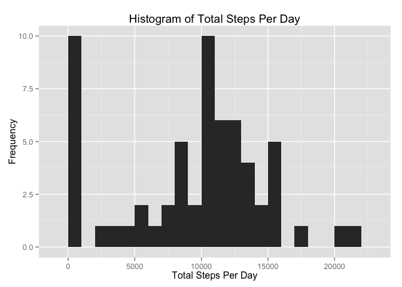
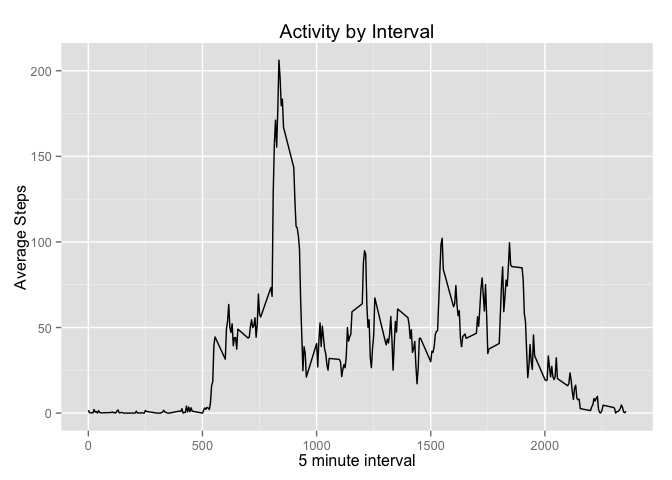
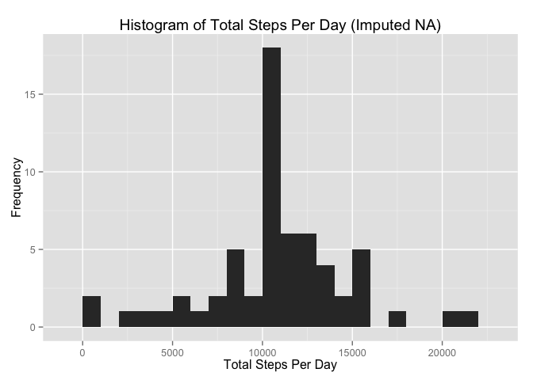
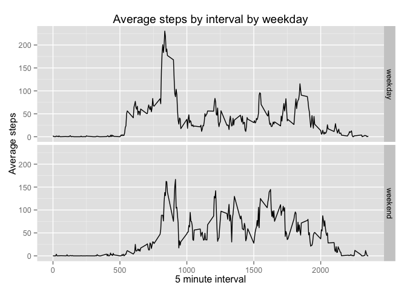

# Reproducible Research: Peer Assessment 1


## Loading and preprocessing the data

```r
library(plyr)
library(ggplot2)
library(xtable)

activity <- read.csv("activity.csv")
activity$date <- as.Date(activity$date, "%Y-%m-%d")
```

## What is mean total number of steps taken per day? 

```r
activitySummary <- ddply(activity, c("date"), summarize, 
                  mean=mean(steps, na.rm=TRUE), 
                  sum=sum(steps, na.rm=TRUE),
                  median=median(steps, na.rm=TRUE))

qplot(activitySummary$sum, geom="histogram", binwidth=1000, 
      main="Histogram of Total Steps Per Day", 
        xlab="Total Steps Per Day", ylab="Frequency")
```

 

**Mean** steps per day: 9354.2295082  
**Median** steps per day: 10395  


## What is the average daily activity pattern?

```r
activitySummaryByInterval <- ddply(activity, c("interval"), summarize, 
                         mean=mean(steps, na.rm=TRUE), 
                         sum=sum(steps, na.rm=TRUE),
                         median=median(steps, na.rm=TRUE))
maxAvgInterval <- activitySummaryByInterval[activitySummaryByInterval$mean == max(activitySummaryByInterval$mean), c("interval")]

qplot(activitySummaryByInterval$interval, activitySummaryByInterval$mean, 
        geom="line", main="Activity by Interval",
        xlab="5 minute interval",
        ylab="Average Steps")
```

 

The 5 minute interval with the highest averge steps is: 835.  

## Imputing missing values

```r
totalNAs <- length(activity$steps[is.na(activity$steps)])

#Substitue NA's with the mean value for the interval
activityNoNA <- join(activity, activitySummaryByInterval, by = "interval", type="left")
activityNoNA <- transform(activityNoNA, steps = ifelse(is.na(steps), mean, steps))
```

The total number of NA's in the data set is: 2304  


```r
activitySummaryNoNA <- ddply(activityNoNA, c("date"), summarize, 
                  mean=mean(steps, na.rm=TRUE), 
                  sum=sum(steps, na.rm=TRUE),
                  median=median(steps, na.rm=TRUE))

qplot(activitySummaryNoNA$sum, geom="histogram", binwidth=1000, 
      main="Histogram of Total Steps Per Day (Imputed NA)", 
        xlab="Total Steps Per Day", ylab="Frequency")
```

 

**Mean** steps per day (Imputed NA): 1.0766189\times 10^{4}  
**Median** steps per day (Imputed NA): 1.0766189\times 10^{4}  

The difference between the imputed mean and regular mean is 1411.959171.  
The difference between the imputed median and regular median is 371.1886792.  

## Are there differences in activity patterns between weekdays and weekends?


```r
#Determine if the date is a weekday or weekend
activityNoNA <- transform(activityNoNA, dayofweek = weekdays(date, TRUE))
activityNoNA <- transform(activityNoNA, weekday = ifelse(dayofweek %in% c("Sat", "Sun"), "weekend", "weekday"))

activityByWeekDay <- ddply(activityNoNA, c("interval", "weekday"), summarize, 
                       mean=mean(steps, na.rm=TRUE), 
                       sum=sum(steps, na.rm=TRUE),
                       median=median(steps, na.rm=TRUE))

ggplot(activityByWeekDay, aes(interval, mean)) + 
    geom_line() + 
  facet_grid(weekday ~ .) +
  xlab("5 minute interval") +
  ylab("Average steps") +
  ggtitle("Average steps by interval by weekday")
```

 
